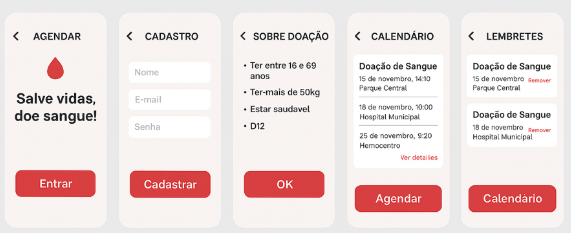
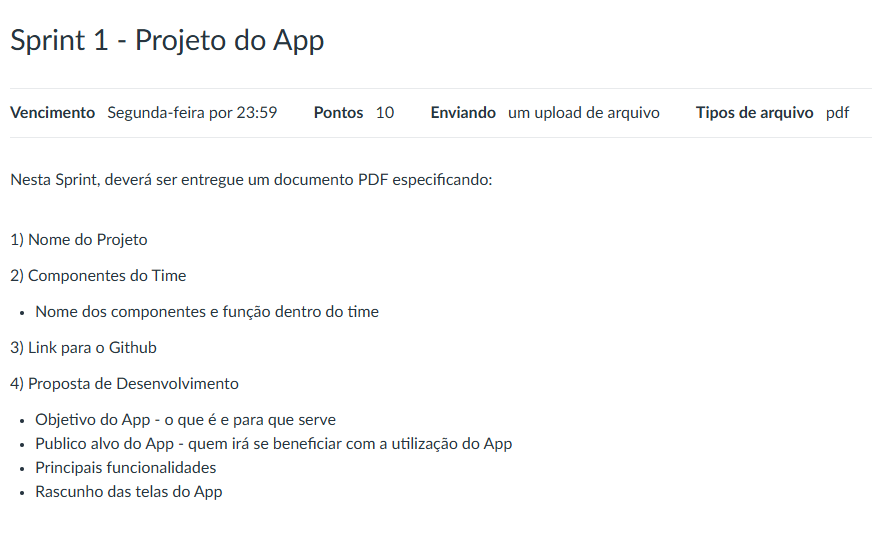

# 💉 Gotas de Esperança


## 📱 Projeto Integrado I: Desenvolvimento Móvel

**Professor:** Ilo Amy Saldanha Rivero  
**Curso:** Desenvolvimento Móvel  
**Grupo:** 1 CANVAS  
**Sprint:** 1 - Projeto do App

---

## 🎯 Sobre o Projeto

**Gotas de Esperança** é um aplicativo móvel que evoca a imagem do sangue (gotas) como algo que traz esperança para quem precisa. O nome foi escolhido para gerar empatia e conscientização sobre a importância da doação de sangue e sua capacidade de salvar vidas.

### 🎨 Conceito do Nome
O nome "Gotas de Esperança" foi pensado para:
- Evocar a imagem do sangue (gotas) como símbolo de vida
- Representar a esperança que cada doação traz
- Gerar empatia e conscientização na sociedade
- Destacar o impacto positivo de cada doador

---

## 👥 Equipe do Projeto

| Função | Nome | Responsabilidades |
|--------|------|-------------------|
| **QA/P.O** | Eduardo Alves Salgado Lisboa Oliveira | Garantia de qualidade e Product Owner |
| **Developer/QA** | Filipe Quaresma Pereira | Desenvolvimento e testes |
| **Developer/QA** | Robson Duarte Vicente | Desenvolvimento e testes |
| **Product Manager** | Vinicius Cezar Pereira Menezes | Gestão do produto |

---

## 📱 Telas do Aplicativo

### Interface Principal


*Interface principal do aplicativo Gotas de Esperança*

---

## 📅 Cronograma e Sprints

### 📊 Planilha Editável do Cronograma
**🔗 [Acessar Cronograma Completo](cronograma/cronograma_projeto.md)**

A equipe utiliza uma **planilha editável** para gerenciar o cronograma do projeto, permitindo:
- ✅ Atualizações em tempo real
- ✅ Colaboração simultânea
- ✅ Acompanhamento de progresso
- ✅ Histórico de alterações

### Sprint 1 - Projeto do App


*Planejamento e definição inicial do projeto*

---

## 🏗️ Estrutura do Projeto

```
Gotas de Esperança/
├── 📁 app/                 # Código fonte do aplicativo
├── 📁 cronograma/          # Cronogramas e planejamentos
├── 📁 img/                 # Imagens e assets
│   └── telas.png          # Telas do aplicativo
├── 📁 referencias/         # Referências e documentação
├── 📁 sprints/            # Documentação das sprints
│   └── 1/                 # Sprint 1
│       └── sprint1.png    # Documentação da Sprint 1
└── 📄 README.md           # Este arquivo
```

---

## 🚀 Funcionalidades Planejadas

- [ ] Sistema de cadastro de doadores
- [ ] Agendamento de doações
- [ ] Histórico de doações
- [ ] Notificações e lembretes
- [ ] Informações sobre doação de sangue
- [ ] Localização de hemocentros
- [ ] Sistema de gamificação

---

## 🛠️ Tecnologias Utilizadas

- **Frontend:** [A definir]
- **Backend:** [A definir]
- **Banco de Dados:** [A definir]
- **Ferramentas de Desenvolvimento:** [A definir]

---

## 📋 Status do Projeto

**Status Atual:** Em desenvolvimento  
**Fase:** Sprint 1 - Planejamento e definição  
**Início dos Trabalhos:** 11/08/2025  
**Entrega Sprint 1:** 25/08/2025

---

## 📞 Contato

Para dúvidas sobre o projeto, entre em contato com a equipe através dos canais institucionais da faculdade.

---

## 📝 Licença

Este projeto foi desenvolvido para fins acadêmicos como parte do curso de Desenvolvimento Móvel.

---

*Desenvolvido com ❤️ pela equipe Gotas de Esperança*
